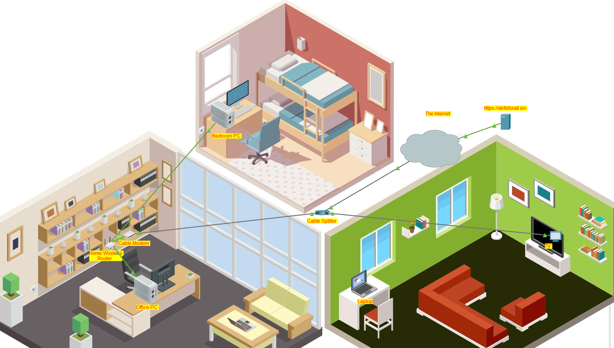

# 🌐 Cisco Networking Labs

## 📝 Description du projet
Ce dossier regroupe mes travaux pratiques réalisés sur **Cisco Packet Tracer** dans le cadre de ma montée en compétence sur les couches basses (L1-L3) et la sécurité réseau.

---

## 🛠 Lab 1 : Configuration d'un Routeur sans fil et d'un Client
**Fichier :** `Configure_a_wireless_Router_and_Client.pka`

### 🎯 Objectifs
* Configurer l'interface d'administration d'un routeur sans fil.
* Paramétrer le SSID et la sécurité (WPA2).
* Connecter un client sans fil et vérifier l'attribution d'IP via DHCP.
* Tester la connectivité de bout en bout (ICMP/Ping).

### 🖼 Topologie du réseau

### 🚀 Résultats
- [x] Connectivité établie entre le Laptop et le serveur distant.
- [x] DHCP fonctionnel (attribution automatique des IPs).
- [x] Sécurisation du point d'accès validée.

